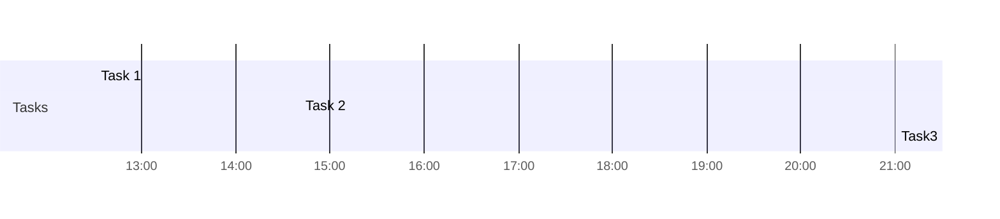

## Day Planner

```mermaid
gantt
    dateFormat  HH-mm
    axisFormat %H:%M
    %% Current Time: 11:49:50 PM
    section Tasks
    Task 1     :12-30, 130mm
    Task 2     :14-40, 380mm
    Task3     :21-00, 0mm
    section Breaks

```

- [x] 12:30 Task 1
- [x] 14:40 Task 2
- [x] 21:00 Task3