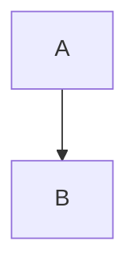

Second note which is older than [[First Notes]].
#concept 

```cpp
int main() {
 return 0;
}
```

![[Pasted image 20201206151344.png]]

$$ f = ma $$
$$ f(x) = \int_x sin(x)dx $$


<iframe width="560" height="315" src="https://www.youtube.com/embed/98EFiAxCLuY" frameborder="0" allow="accelerometer; autoplay; clipboard-write; encrypted-media; gyroscope; picture-in-picture" allowfullscreen></iframe>

<iframe height="400px" width="100%" src="https://repl.it/@Amir_HosseinHo3/AdmirableHightechUnderstanding?lite=true" scrolling="no" frameborder="no" allowtransparency="true" allowfullscreen="true" sandbox="allow-forms allow-pointer-lock allow-popups allow-same-origin allow-scripts allow-modals"></iframe>

